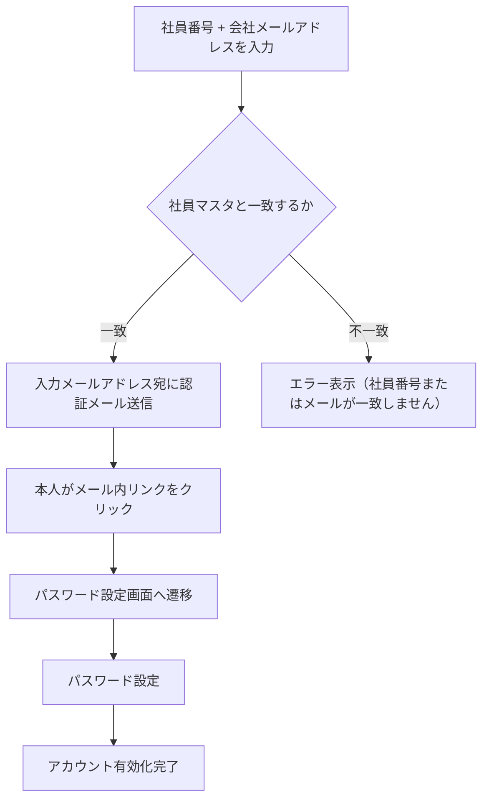
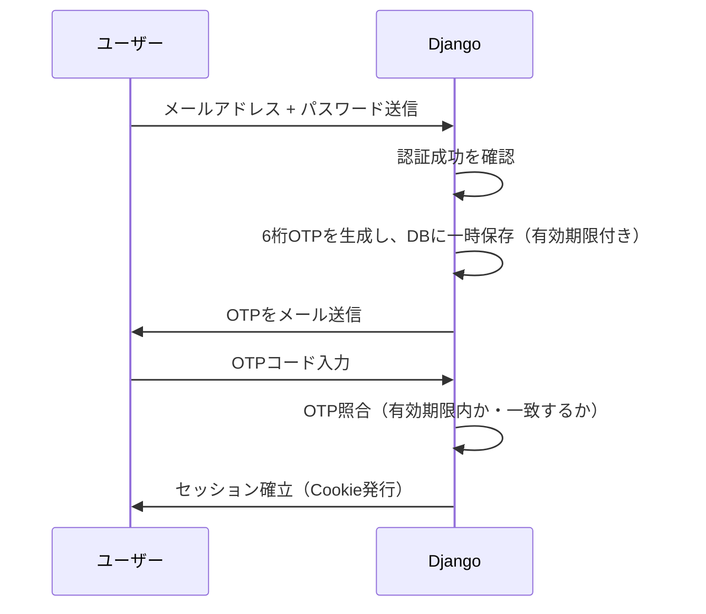

# 07_認証・セキュリティ詳細

> この文書を唯一の正として実装すること。不明点は推測せず、本文中の `TODO` に記録すること。
> Django標準機能を優先し、可読性・保守性・セキュリティを優先すること。
>
> プロジェクト名: 社内行先・在席管理システム（Internal Presence Management System）
> リポジトリ名: presence-board

---

## 0. この文書の位置づけ

`01_プロジェクト概要.md` の4段階セキュリティ設計を、実装レベルまで詳細化する。

---

## 1. 4段階セキュリティ設計（再掲・詳細化）

| 段階 | 内容 | 実装詳細 |
|---|---|---|
| 1 | Django認証 / HTTPS | セッション認証＋メールOTP2段階認証。HTTPS方針は `06_API・SSE設計.md` の要確認事項を参照 |
| 2 | 会社グローバルIP制限 | Oracle Cloudセキュリティリスト／ファイアウォールで実現（アプリ側チェックなし、`06`参照） |
| 3 | セッションタイムアウト | 30日間無操作で自動失効（Django `SESSION_COOKIE_AGE` で設定） |
| 4 | 管理者権限分離 | Django標準の `is_staff` / `is_superuser` を活用。中間権限（部署管理者）は将来拡張枠として設計 |

---

## 2. 初回登録フロー

- `TODO`: 「社員マスタ」の初期データ投入方法（管理者が事前にEmployeeProfileを一括登録するCSVインポート機能等）は実装時に確定する。
- 認証メールのリンクには有効期限付きトークンを付与する（Django標準の `PasswordResetTokenGenerator` 相当の仕組みを流用）。
  - `TODO`: トークン有効期限（例: 24時間）は実装時に確定する。

---

## 3. ログイン・2段階認証（OTP）フロー

### 確定事項・TODO
- OTPは6桁の数字とする。
- `TODO`: OTP有効期限（例: 5分）、再送信の可否・間隔制限は実装時に確定する。
- OTP照合失敗を一定回数繰り返した場合のロック処理: `TODO`（ブルートフォース対策として要検討）。

---

## 4. セッション管理

| 項目 | 設定 |
|---|---|
| セッション有効期間 | 30日（`SESSION_COOKIE_AGE = 60 * 60 * 24 * 30`） |
| セッション延長方式 | アクセスの都度延長する（`SESSION_SAVE_EVERY_REQUEST = True`） |
| Cookie属性 | `Secure`, `HttpOnly`, `SameSite=Lax` を設定（HTTPS運用が確定次第 `Secure` を有効化） |
| タイムアウト時の状態 | 変更しない（`03_業務フロー.md` 5章の通り、CurrentStatusは保持） |

- 「紛失時は管理者が強制ログアウト」の実現方法: Django標準のセッションストア（DB）から対象ユーザーのセッションレコードを削除するAPIを管理者用に用意する。
  - `TODO`: 管理者画面のUI詳細は `08_管理者機能.md` で扱う。

---

## 5. 管理者権限設計

- 初版では以下2権限のみとする（`01_プロジェクト概要.md` の方針通り）:
  - 一般ユーザー: 自分の状態変更・事前登録・お気に入り管理のみ可能
  - システム管理者（`is_superuser`）: 全ユーザーの強制ログアウト、社員マスタ管理、組織情報（部・課・グループ）管理
- **将来拡張として、部署管理者（中間権限）を追加できる設計にする**（`02_要件定義.md` 通り）。
  - 実装方針: Django標準の権限（Permission）＋グループ機能（`django.contrib.auth.models.Group`。業務上の組織階層テーブルは`Team`に確定済みのため名前は重複しない）を活用し、
    「自部署のユーザーのみ強制ログアウト可能」等のスコープ付き権限を将来追加できるようモデル設計しておく。
  - **命名衝突は解消済み**: `05_データモデル.md` の組織階層テーブルは `Team` に確定した（Django標準の `Group` モデルとは名前が重複しないため、将来の部署管理者権限をDjango標準Groupで実装しても衝突しない）。

---

## 6. パスワードポリシー

- Django標準の `AUTH_PASSWORD_VALIDATORS` を使用する（最低文字数・一般的すぎるパスワードの禁止・数字のみの禁止等）。
- `TODO`: 社内規則で最低文字数等の指定があれば反映する（現時点では未確認）。

---

## 7. その他セキュリティ対策

| 項目 | 方針 |
|---|---|
| CSRF対策 | Django標準のCSRFミドルウェアを使用（フォーム・API双方） |
| XSS対策 | Djangoテンプレートの自動エスケープに依存し、`\|safe` フィルタの濫用を禁止する |
| SQLインジェクション対策 | ORMのみを使用し、生SQLを書かない（`01_プロジェクト概要.md` 方針通り） |
| 依存パッケージ脆弱性対策 | GitHub Actions上で `pip-audit` 等を定期実行する（`09_非機能要件.md` で詳細化） |
| ログ・監査証跡 | 状態変更は `StatusHistory` に残るが、ログイン試行・管理者操作のログについては別途検討が必要 |

- `TODO`: ログイン失敗ログ・管理者操作ログの保存要否と保存期間は未確定。セキュリティ監査の観点から検討推奨。

---

## 8. 本章で確定した仕様のまとめ（差分）

| 項目 | 内容 |
|---|---|
| 初回登録 | 社員番号＋会社メール一致確認 → 認証メール → パスワード設定 |
| OTP | 6桁数字、メール送信 |
| セッション | 30日、アクセス毎延長、タイムアウト時も状態保持 |
| 権限 | 一般／システム管理者の2段階＋将来の部署管理者拡張枠 |

---

## 9. 未確定事項（TODO一覧）

- [ ] 社員マスタの初期データ投入方法
- [ ] 認証メールトークンの有効期限
- [ ] OTP有効期限・再送信制限・ロック処理
- [ ] ログイン失敗ログ・管理者操作ログの保存方針
- [ ] 社内パスワードポリシーの具体的な規定有無

---

## 10. 次のステップ

- `08_管理者機能.md` にて、強制ログアウト・社員マスタ管理・組織情報管理のUI／APIを設計する。
