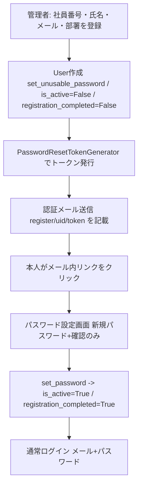
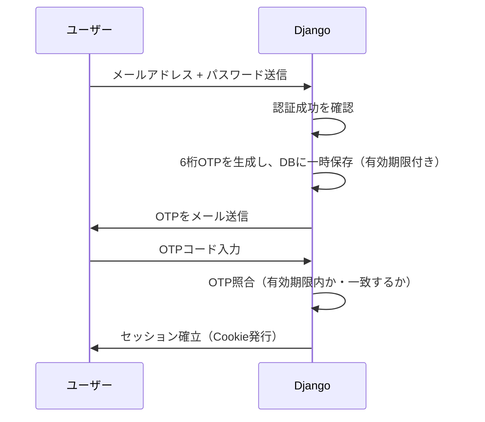

# 07_認証・セキュリティ詳細

> この文書を唯一の正として実装すること。不明点は推測せず、本文中の `TODO` に記録すること。
> Django標準機能を優先し、可読性・保守性・セキュリティを優先すること。
>
> プロジェクト名: 社内行先・在席管理システム（Internal Presence Management System）
> リポジトリ名: presence-board

---

## 0. この文書の位置づけ

`01_プロジェクト概要.md` の4段階セキュリティ設計を、実装レベルまで詳細化する。

---

## 1. 4段階セキュリティ設計（再掲・詳細化）

| 段階 | 内容 | 実装詳細 |
|---|---|---|
| 1 | Django認証 / HTTPS | セッション認証＋メールOTP2段階認証。HTTPS方針は `06_API・SSE設計.md` の要確認事項を参照 |
| 2 | 会社グローバルIP制限 | Oracle Cloudセキュリティリスト／ファイアウォールで実現（アプリ側チェックなし、`06`参照） |
| 3 | セッションタイムアウト | 30日間無操作で自動失効（Django `SESSION_COOKIE_AGE` で設定） |
| 4 | 管理者権限分離 | Django標準の `is_staff` / `is_superuser` を活用。中間権限（部署管理者）は将来拡張枠として設計 |

---

## 2. 初回登録フロー（確定）

運用フロー（5ステップ）。独自のトークンテーブルは作らず、Django 標準の `PasswordResetTokenGenerator` を利用する。



- **Step1 仮登録（管理者）**
  - 管理者が `Employee` を作成する。このとき入力するのは **社員番号・氏名・メールアドレス・部署** の4項目のみ（グループは未指定でも可）。
  - 同時に Django 標準の `User` を1件作成する。
    - `username` = メールアドレス（`User.email` にも同じ値を設定）
    - `set_unusable_password()` でパスワード未設定状態
    - `is_active = False`
    - 対応する `Employee.registration_completed = False`
  - 設計書の「社員マスタ」＝ `Employee` であり、初回登録の前提は「管理者があらかじめ Employee を登録していること」とする。CSV一括登録等は別 Issue で対応。

- **Step2 トークン発行**
  - Django 標準の `PasswordResetTokenGenerator`（`django.contrib.auth.tokens.default_token_generator`）を利用する。
  - `token = default_token_generator.make_token(user)`
  - `uid = urlsafe_base64_encode(force_bytes(user.pk))`
  - 認証用URL: `{FRONTEND_URL}/register/{uidb64}/{token}/`
  - 独自のトークンテーブル（RegistrationToken 等）は **作成しない**。Django 標準の仕組みで安全性を担保する。

- **Step3 メール送信**
  - テンプレート例:
    ```
    こんにちは。
    これはFSTの社員行先掲示板システムからの自動メールです。

    社員行先掲示板にアクセスするためのパスワードの登録を行います。
    以下のURLからパスワードを設定してください。
    （有効期限 24 時間）

    {url}
    ```
  - メール送信基盤: `EMAIL_BACKEND` 等を `.env` から読み込む（開発環境は `console.EmailBackend` で実送信せずコンソール出力）。

- **Step4 パスワード設定**
  - 画面項目は **新しいパスワード / 確認用** のみ（ユーザー名・メールは非表示）。
  - Django 標準の `PasswordResetConfirmView` を流用（カスタムテンプレートのみ差し替え）。
  - 成功時: `user.set_password(...)` → `user.is_active = True` → 対応 `Employee.registration_completed = True` を保存。

- **Step5 ログイン**
  - 通常ログイン（メールアドレス + パスワード）。ログインIDはメールアドレス（設計書セクション2・3 に準拠）。

### 確定事項・方針
- ログインIDは **メールアドレス**（社員番号は仮登録時の照合用）。既存 Login.vue のラベルを「メールアドレス」に修正（実装時）。
- SSO / Microsoft アカウント連携は **今回実装しない**。客先常駐社員が MS アカウントを持たないため、メール認証が主軸。将来拡張枠として保留。
- `Employee` と `User` の紐付けは既存の「メールアドレス一致」で行う（追加の外部キーは作らない＝DB変更を最小化）。

### DB変更サマリー（最小構成）
- `Employee.registration_completed` : `BooleanField(default=False)` を **追加**
- `Employee.group` : `null=True, blank=True` に変更（仮登録時は部署のみで可）
- `auth_user` は標準のまま（カスタム User モデルは導入しない）。User を作成するだけ。
- 新規テーブル・新規モデルは **なし**。
- （将来の Entra ID 移行時）`Employee` に `auth_provider` / `entra_object_id` を追加予定（セクション11参照）。現段階では未作成。

### 設定値（settings.py / .env）
- `PASSWORD_RESET_TIMEOUT = 86400`（24時間）。トークン有効期限。
- `EMAIL_BACKEND` / `EMAIL_HOST` / `EMAIL_PORT` / `EMAIL_HOST_USER` / `EMAIL_HOST_PASSWORD` / `DEFAULT_FROM_EMAIL` を `.env` から読み込む。
- `FRONTEND_URL`（認証メール内のリンクを組み立てるためのフロントエンド基底URL）。

---

## 3. ログイン・2段階認証（OTP）フロー



### 確定事項・TODO
- OTPは6桁の数字とする。
- `TODO`: OTP有効期限（例: 5分）、再送信の可否・間隔制限は実装時に確定する。
- OTP照合失敗を一定回数繰り返した場合のロック処理: `TODO`（ブルートフォース対策として要検討）。

---

## 4. セッション管理

| 項目 | 設定 |
|---|---|
| セッション有効期間 | 30日（`SESSION_COOKIE_AGE = 60 * 60 * 24 * 30`） |
| セッション延長方式 | アクセスの都度延長する（`SESSION_SAVE_EVERY_REQUEST = True`） |
| Cookie属性 | `Secure`, `HttpOnly`, `SameSite=Lax` を設定（HTTPS運用が確定次第 `Secure` を有効化） |
| タイムアウト時の状態 | 変更しない（`03_業務フロー.md` 5章の通り、CurrentStatusは保持） |

- 「紛失時は管理者が強制ログアウト」の実現方法: Django標準のセッションストア（DB）から対象ユーザーのセッションレコードを削除するAPIを管理者用に用意する。
  - `TODO`: 管理者画面のUI詳細は `08_管理者機能.md` で扱う。

---

## 5. 管理者権限設計

- 初版では以下2権限のみとする（`01_プロジェクト概要.md` の方針通り）:
  - 一般ユーザー: 自分の状態変更・事前登録・お気に入り管理のみ可能
  - システム管理者（`is_superuser`）: 全ユーザーの強制ログアウト、社員マスタ管理、組織情報（部・課・グループ）管理
- **将来拡張として、部署管理者（中間権限）を追加できる設計にする**（`02_要件定義.md` 通り）。
  - 実装方針: Django標準の権限（Permission）＋グループ機能（`django.contrib.auth.models.Group`。業務上の組織階層テーブルは`Team`に確定済みのため名前は重複しない）を活用し、
    「自部署のユーザーのみ強制ログアウト可能」等のスコープ付き権限を将来追加できるようモデル設計しておく。
  - **命名衝突は解消済み**: `05_データモデル.md` の組織階層テーブルは `Team` に確定した（Django標準の `Group` モデルとは名前が重複しないため、将来の部署管理者権限をDjango標準Groupで実装しても衝突しない）。

---

## 6. パスワードポリシー

- Django標準の `AUTH_PASSWORD_VALIDATORS` を使用する（最低文字数・一般的すぎるパスワードの禁止・数字のみの禁止等）。
- `TODO`: 社内規則で最低文字数等の指定があれば反映する（現時点では未確認）。

---

## 7. その他セキュリティ対策

| 項目 | 方針 |
|---|---|
| CSRF対策 | Django標準のCSRFミドルウェアを使用（フォーム・API双方） |
| XSS対策 | Djangoテンプレートの自動エスケープに依存し、`\|safe` フィルタの濫用を禁止する |
| SQLインジェクション対策 | ORMのみを使用し、生SQLを書かない（`01_プロジェクト概要.md` 方針通り） |
| 依存パッケージ脆弱性対策 | GitHub Actions上で `pip-audit` 等を定期実行する（`09_非機能要件.md` で詳細化） |
| ログ・監査証跡 | 状態変更は `StatusHistory` に残るが、ログイン試行・管理者操作のログについては別途検討が必要 |

- `TODO`: ログイン失敗ログ・管理者操作ログの保存要否と保存期間は未確定。セキュリティ監査の観点から検討推奨。

---

## 8. 本章で確定した仕様のまとめ（差分）

| 項目 | 内容 |
|---|---|
| 初回登録 | 管理者が Employee 仮登録（社員番号・氏名・メール・部署）→ User 作成(is_active=False) → PasswordResetTokenGenerator でトークン発行 → 認証メール → パスワード設定(set_password, is_active=True, registration_completed=True) |
| トークン | Django標準 `PasswordResetTokenGenerator`（独自テーブル不要）。有効期限 24時間（`PASSWORD_RESET_TIMEOUT=86400`） |
| ログインID | メールアドレス（`User.username = email`）。社員番号は仮登録時の照合用 |
| OTP | 6桁数字、メール送信（実装は別 Issue） |
| セッション | 30日、アクセス毎延長、タイムアウト時も状態保持 |
| 権限 | 一般／システム管理者の2段階＋将来の部署管理者拡張枠 |
| SSO/MS連携 | 今回実装しない（客先常駐社員が MS アカウントを持たないため）。将来の Entra ID(OIDC) 移行は セクション11 に設計（実装は別 Issue、条件付き） |

---

## 9. 未確定事項（TODO一覧）

- [x] **社員マスタの初期データ投入方法** → 前提を「管理者が Employee を個別登録（Step1）」とし、CSV一括インポートは別 Issue で対応とする。
- [x] **認証メールトークンの有効期限** → 24時間（`PASSWORD_RESET_TIMEOUT=86400`）。Django標準 `PasswordResetTokenGenerator` を利用。
- [x] **ログインIDの扱い** → メールアドレス（設計書セクション2・3 準拠）。社員番号は仮登録時の照合用。
- [x] **SSO / Microsoft アカウント連携** → 今回実装しない。客先常駐社員が MS アカウントを持たないため。将来拡張枠。
- [ ] **OTP有効期限・再送信制限・ロック処理**（セクション3）→ 別 Issue で対応。
- [ ] **ログイン失敗ログ・管理者操作ログの保存要否と保存期間**（セクション7）→ 別 Issue で対応。セキュリティ監査の観点から検討推奨。
- [ ] **社内パスワードポリシーの具体的な規定有無**（セクション6）→ 未確認。現時点は Django 標準 `AUTH_PASSWORD_VALIDATORS` の既定値を適用。

---

## 10. 次のステップ

- `08_管理者機能.md` にて、強制ログアウト・社員マスタ管理・組織情報管理のUI／APIを設計する。

---

## 11. 将来対応設計：Microsoft Entra ID（OIDC）認証への移行

> 本章は**設計のみ**。「実装しない」前提の将来構想として記載し、現時点の Django 標準認証を妨げない。

### 11.1 背景

現在の認証方式は Django 標準認証（社員ID・メールアドレス・パスワード）を採用している。
現在は全社員が Microsoft 365 アカウントを保有していない（客先常駐社員が MS アカウントを持たない）ため、Entra ID を認証基盤として採用することはできず、現段階では Django 認証を継続利用する。

### 11.2 将来構想

将来的に全社員へ Microsoft 365（Microsoft Entra ID）アカウントが配布された場合、認証方式を OpenID Connect (OIDC) に変更できる設計とする。認証は Entra ID が担当し、Presence Board は認証済みユーザー情報のみを受け取る構成へ移行する（Presence Board ではパスワードを保持しない）。

```
Browser
    │
    ▼
Microsoft Entra ID
    │  OIDC Login
    ▼
Presence Board
```

### 11.3 データベース変更（想定）

`Employee` テーブルへ以下のカラム追加を想定する。

| 項目 | 説明 |
|---|---|
| `entra_object_id` | Microsoft Entra ID Object ID |
| `auth_provider` | 認証方式（`local` / `entra`） |

```
Employee
---------
id
employee_no
name
email
auth_provider
entra_object_id
```

### 11.4 ログインフロー

- **Local認証（現行）**

  ```
  Browser → Login → Django Authentication → Presence Board
  ```

- **Entra ID認証（将来）**

  ```
  Browser → Microsoft Entra ID（認証成功）→ ID Token → Presence Board
  ```

  Presence Board は `email` または `Object ID` で社員を特定する。

### 11.5 認証プロバイダーの抽象化

認証方式は設定ファイルで切り替え可能とする。

```
AUTH_PROVIDER=local
```

または

```
AUTH_PROVIDER=entra
```

将来的には `local` / `entra` / `google` / その他OIDC対応IdP へ拡張可能な構造とする。`AuthenticationService` 等の抽象レイヤーを設け、アプリケーション側が認証方式に依存しない設計を推奨する。

### 11.6 監査ログ

認証方式に関わらず監査ログは共通仕様とする。

```
ログイン成功
ログアウト
在席変更
AIエージェント操作
```

Entra ID 利用時は必要に応じて `Object ID` / `Tenant ID` なども監査情報として保存可能な設計とする。

### 11.7 AIエージェント・MCP連携

将来的に AI エージェントや MCP Server が Presence Board を操作する場合も、Microsoft Entra ID を利用した OAuth2/OIDC 認証へ統一できる設計とする。

```
AI Agent → Microsoft Entra ID → Access Token → MCP Server → Presence Board API
```

これにより、社員認証・AI認証・権限管理・監査ログを共通基盤で一元管理できる。

### 11.8 実装方針

現時点では実装しない。以下の条件が満たされた時点で実装を開始する。

- 全社員へ Microsoft Entra ID アカウントが配布された
- OIDC による認証基盤を利用可能となった
- Microsoft Entra ID のテナント運用が開始された

それまでは Django 標準認証を利用する。この設計により、将来的な認証基盤の変更を最小限の修正で実現できる。
