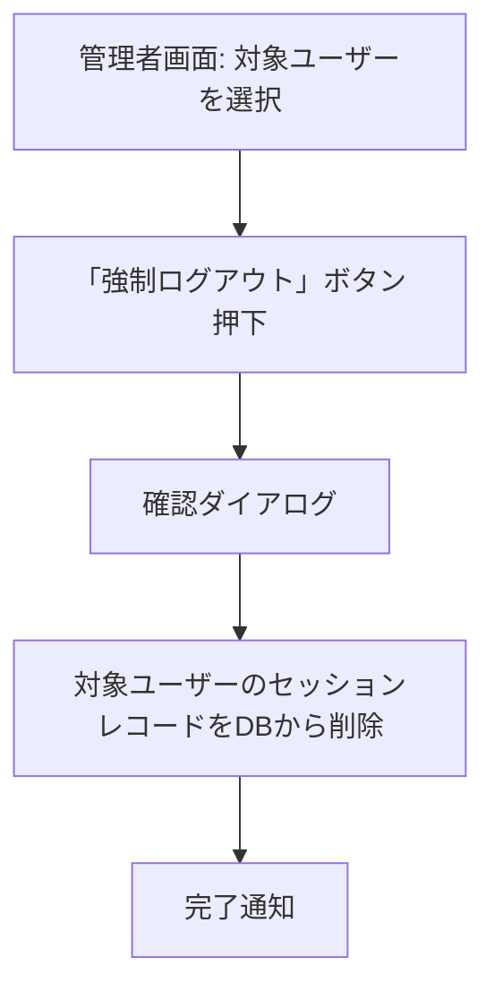

# 08_管理者機能（叩き台）

> ⚠️ この文書は「叩き台」です。01〜07の確定事項から妥当な内容を推測して作成していますが、
> 大井さんによるヒアリング・レビューを経ていません。実装前に必ず内容を確認・修正してください。
> 不明点・要検討点は `TODO` として明記しています。

> Django標準機能を優先し、可読性・保守性・セキュリティを優先すること。
>
> プロジェクト名: 社内行先・在席管理システム（Internal Presence Management System）
> リポジトリ名: presence-board

---

## 0. この文書の位置づけ

`03_業務フロー.md` 6章、`07_認証・セキュリティ詳細.md` 5章で「別ファイルで扱う」とされた
管理者機能（強制ログアウト、社員マスタ管理、組織情報管理）を扱う。

---

## 1. 管理者機能一覧（叩き台）

| 機能 | 概要 | 優先度 |
|---|---|---|
| 強制ログアウト | 特定ユーザーのセッションを無効化 | 高（01・02で明記済み） |
| 社員マスタ管理 | 社員の追加・編集・退職時の無効化 | 高（運用上必須） |
| 組織情報管理 | 部・課・グループの追加・編集 | 中 |
| 状態の代理変更 | 管理者が他ユーザーの状態を代理で変更 | `TODO`（要否未確認） |

---

## 2. 強制ログアウト（詳細・07からの再掲）

- 実装方式: Django標準のセッションストア（`django_session` テーブル）から対象ユーザーに紐づくセッションを特定し削除する。
- `TODO`: セッションとユーザーの紐付け特定方法（Djangoのセッションストアは標準ではユーザーIDで直接検索できないため、セッションデータをデコードして特定するか、独自の中間テーブルを持つか）は実装時に確定する。

---

## 3. 社員マスタ管理（叩き台）

- Django管理サイト（`django.contrib.admin`）をベースにカスタマイズすることを推奨する（`01_プロジェクト概要.md` の「Django標準機能を優先」方針に合致し、開発コストを抑えられる）。
- 主な操作: 社員の追加、氏名・所属・連絡先の編集、退職者の無効化（`User.is_active = False`）。
- `TODO`: 退職者データの扱い（物理削除は行わず、無効化のみとする想定。過去の`StatusHistory`との整合性のため）。

---

## 4. 組織情報管理（叩き台）

- Django管理サイトで `Department` / `Section` / `Team` の追加・編集を行う想定。
- `TODO`: 課・グループの削除時、所属社員が存在する場合の挙動（削除禁止 or 未所属状態を許可）は未確定。

---

## 5. 未確定事項（TODO一覧）

- [ ] 状態の代理変更機能の要否
- [ ] セッション・ユーザー紐付けの実装方式
- [ ] 退職者データの扱い（無効化のみか、一定期間後に削除するか）
- [ ] 組織情報削除時の制約
- [ ] 管理者画面をDjango管理サイトのカスタマイズで済ませるか、専用画面を作るか（**要確認: 大井さんの意向次第でコスト・工数が大きく変わる**）

---

## 6. 次のステップ

- 上記TODO、特に「管理者画面の実装方針（Django管理サイト活用 vs 専用画面）」を大井さんに確認の上、確定版へ更新する。
